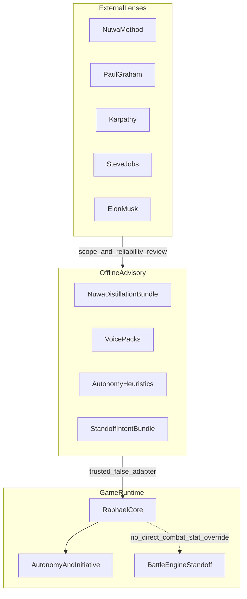

# Raphael Training Ops Playbook

Created: 2026-07-14  
Status: active ops guide (docs authority for skill／外掛／進度路由)  
Owner lane: Raphael Core, Companion Reasoning, And Soul Talk

## 1. Purpose

把「怎麼訓練 RaphaelCore」從散落對話變成可執行進度：

- 哪個問題走哪條车道（對話／自主／對峙／遠征）
- 哪個技能或外掛人格可以碰、哪些絕對不能進 runtime
- 每週怎麼跑完 Gate 0–6 與人類 feel check

權威交叉引用：

- 工具路由：[`NEXUSLINK_AI_DEVELOPMENT_MODE.md`](./NEXUSLINK_AI_DEVELOPMENT_MODE.md) §4
- 外部人格白名單：[`NEXUSLINK_COPYWRITING_FINAL_PASS.md`](../content/NEXUSLINK_COPYWRITING_FINAL_PASS.md) §2
- Nuwa 蒸餾契約：[`RAPHAEL_NUWA_DISTILLATION_SPEC.md`](../raphael/RAPHAEL_NUWA_DISTILLATION_SPEC.md)
- 評測缺口：[`RAPHAEL_EVAL_COVERAGE_MATRIX.md`](../raphael/RAPHAEL_EVAL_COVERAGE_MATRIX.md)
- 排隊包：[`NEXT_AI_TASK_PACK_QUEUE.md`](./NEXT_AI_TASK_PACK_QUEUE.md)

## 2. Three layers (do not mix)

| Layer | What it is | Examples | May speak to player? |
| --- | --- | --- | --- |
| External persona skills | Critique / methodology lenses only | Nuwa method, Paul Graham, Karpathy, Steve Jobs, Elon Musk | **No** |
| Game companion personas | Runtime knobs + voice packs | Greyshade, Heartspark five | **Yes** (authored packs) |
| Engine behaviour | Autonomy / standoff / expedition | `autonomyLoop`, `battleEngine`, `companionBrain` | Via UI／state, not as celebrity voice |



**Hard rule:** external persona skills must never be distilled into
`companionPersonas`, response packs, or player-facing copy as first-person
celebrity imitation.

## 3. Progress order (locked)

1. **Autonomy quality** (RA series) — companion initiates quietly; reuse
   existing stack (`needModel` / `goalManager` / `initiativeCooldown` /
   `companionInitiativeController`). Do not rebuild systems.
2. **Standoff / combat depth** (RS series) — emotional rift standoff, not
   DPS / combo combat.
3. **Expedition brain** (optional, later) — `companionBrain` /
   `combatResolver` only after RA／RS gates are stable. Boundaries live in
   [`RAPHAEL_EXPEDITION_EVAL_CONTRACT.md`](../raphael/RAPHAEL_EXPEDITION_EVAL_CONTRACT.md)
   (RE-1 `draft awaiting seal`). RE-2 runtime (session heart + settlement
   voice split) may proceed on Owner request, but must **not** be labeled
   Core-complete or commercial-ready until Owner seals RE-1 and feel-checks.

Rationale: product audit flagged “companion never initiates” as the largest
differentiation gap; TP-7 already wired player-visible initiative.

## 4. Skill and plugin routing

| Need | Use | Do not use |
| --- | --- | --- |
| Soul Talk tone / heart | Existing Nuwa bundle + `raphael-conversation-eval` | Nuwa as runtime identity |
| Autonomy train / eval | New `raphael-autonomy-eval` (planned RA-3); Nuwa-style heuristics `trusted:false` | Generic agent-autonomy-kit |
| Standoff train / eval | New `raphael-standoff-eval` (planned RS-3); intent heuristics advisory-only | Godot combat skill, AAA combat-design, generic game-ai-behavior |
| Product scope cut | Jobs lens (read-only) | Taste arguments to skip safety / a11y |
| Engineering reliability | Karpathy lens (demo ≠ ship) | Vibe coding as release proof |
| Copy final pass | NexusLink copywriting guide + anti-vibe-writing | Celebrity first-person in player copy |
| Tooling / complexity cut | Musk first-principles (cut sidecar bloat) | Speed pressure to skip GROUNDWORK |
| Code discovery | codebase-memory-mcp | Blind whole-repo grep as first move |
| Long implementation | Cursor / Fable + TASK_PACK + ledger | Multiple agents on one dirty worktree |

### Installed vs planned skills

| Skill | Status | Purpose |
| --- | --- | --- |
| `raphael-conversation-eval` | Installed (`~/.codex/skills/`) | Soul Talk holdout / safety / quality |
| `raphael-autonomy-eval` | **Planned (RA-3)** | Initiative frequency, red-line silence, no loneliness detection |
| `raphael-standoff-eval` | **Planned (RS-3)** | Telegraph, four endings, fatigue withdraw |

Do **not** `npx skills add` combat or celebrity persona skills into this repo
without explicit Owner approval and a source audit.

## 5. Decision tree — which lane to open

```text
Player-visible problem?
├─ Sounds like chatbot / wrong companion voice
│   → Soul Talk lane (Nuwa voice packs + conversation-eval)
├─ Companion never acts first / feels dead in habitat
│   → Autonomy lane (RA-1 → RA-2 → RA-3)
├─ Standoff feels like HP fight / no telegraph rhythm / retreat unrewarded
│   → Standoff lane (RS-1 → RS-2 → RS-3)
├─ Expedition party brain / overworld combat feel
│   → Expedition lane (after RA+RS stable only)
└─ Product copy / store sharpness / process bloat
    → External lens only (PG / Jobs / Karpathy / Musk) → docs or TASK_PACK
       NEVER into Raphael reply packs
```

## 6. Gate 0–6 checklist (every pack)

Copy into the TASK_PACK closeout:

- [ ] **Gate 0** — `git status`, branch, ledger, relevant docs, dirty-file classification
- [ ] **Gate 1** — TASK_PACK with allowed / forbidden files and red lines
- [ ] **Gate 2** — Human approval when required (GROUNDWORK, new skills, commit)
- [ ] **Gate 3** — Edit only allowed files
- [ ] **Gate 4** — Local verification (`node --check`, harness, release gate as scoped)
- [ ] **Gate 5** — Diff review vs `REVIEW_CHECKLIST.md`
- [ ] **Gate 6** — Human says COMMIT / PUSH before any git publish

Standing constraints: no new dependencies; no backend／LLM routing; no save
schema／localStorage key changes unless the pack explicitly grants them;
RaphaelCore remains final authority; advisory stays `trusted:false`.

## 7. Weekly Owner cycle

1. Owner picks **one** TASK_PACK (allowed／forbidden files locked).
2. Pick lenses for the week:
   - Autonomy → Karpathy + Jobs
   - Standoff → Jobs + Constitution Never List
   - Copy → anti-vibe + Nuwa **method** (not Nuwa voice)
3. Implement → harness → conversation-eval **only if** Soul Talk paths changed.
4. Human feel check (device or browser): frequency, quietness, no nagging.
5. Ledger Lane 3 entry → Owner-explicit COMMIT／PUSH only.

## 8. Lane pack map (queue IDs)

| ID | Goal | Typical files | Blocks |
| --- | --- | --- | --- |
| **RA-1** | Autonomy sealed-case contract + harness shape | docs + `companionInitiativeCases.js` | loneliness／login triggers | ✅ 2026-07-14 |
| **RA-2** | Nuwa-style autonomy heuristics advisory | Nuwa bundle mental models / heuristics only | `safetyShield`, `memoryWriter` | ✅ 2026-07-20（無新玩家台詞） |
| **RA-3** | Install `raphael-autonomy-eval` skill | `~/.codex/skills/raphael-autonomy-eval/**` | deepening lines before skill gates pass | planned |
| **RS-1** | Standoff success = emotion／retreat, not DPS | docs + eval contract | traditional combat skills | ✅ 2026-07-14 |
| **RS-2** | Light standoff intent advisory | advisory bundle; numbers stay in `battleEngine.js` | advisory writing combat stats | pending Owner ack |
| **RS-3** | Install `raphael-standoff-eval` skill | skill dir only until approved | combo／hitbox skill imports | planned |

Autonomy contract: [`RAPHAEL_AUTONOMY_EVAL_CONTRACT.md`](../raphael/RAPHAEL_AUTONOMY_EVAL_CONTRACT.md) — `__RAPHAEL_AUTONOMY_EVAL__.runAll()`.  
Standoff contract: [`RAPHAEL_STANDOFF_EVAL_CONTRACT.md`](../raphael/RAPHAEL_STANDOFF_EVAL_CONTRACT.md) — `__RAPHAEL_STANDOFF_EVAL__.runAll()`.

Full pack text lives in [`NEXT_AI_TASK_PACK_QUEUE.md`](./NEXT_AI_TASK_PACK_QUEUE.md).

## 9. Explicit non-goals

- Installing external game-AI or combat skills “just in case”
- Distilling PG／Jobs／Musk／Karpathy into companion Expression DNA
- Mixing Moonlake habitat dirty assets into Raphael training commits
- Treating harness green as human blind-review (still `not_run` until Owner runs it)
