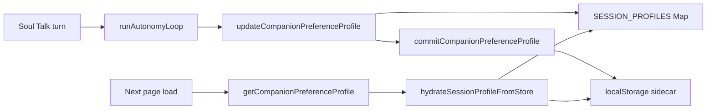

# Companion Preference Persistence v1

## Goal

Carry Level 2 session preferences (reply length, rest affinity, boundary sensitivity, learned signals) across browser reloads **without** modifying `defaultState.js`, `saveManager.js`, `store.js`, or `STORAGE_KEY`.

## Storage

| Key | Value |
|-----|-------|
| `nexusLinkCompanionPrefs:v1` | Sidecar JSON in `localStorage` |

This is intentionally separate from `nexusLinkR2State:v1`. Game state (bond, memories, habitat) stays in the main save; companion *interaction style learning* lives here.

## Schema

```json
{
  "version": 1,
  "updatedAt": 1719187200000,
  "companions": {
    "greyshade-cat": {
      "replyLengthBias": "short",
      "avoidComfortIntensity": 0.12,
      "preferPresenceOverAdvice": true,
      "boundarySensitivity": 0.05,
      "interactionPace": -0.08,
      "eveningAffinity": false,
      "restAffinity": true,
      "learnedSignals": ["fatigue", "rest_request"],
      "sessionCount": 0,
      "lastSeenAt": 1719187200000,
      "updatedAt": 1719187200000
    }
  }
}
```

### Field semantics

| Field | Type | Notes |
|-------|------|-------|
| `replyLengthBias` | `"normal"` \| `"short"` | Sticky: once short, stays short until cleared |
| `avoidComfortIntensity` | 0–1 | Blended across sessions (35% new weight) |
| `boundarySensitivity` | 0–1 | Blended (40% new weight) |
| `interactionPace` | −1–1 | Blended pace bias |
| `preferPresenceOverAdvice` | boolean | OR-merge (sticky true) |
| `eveningAffinity` / `restAffinity` | boolean | OR-merge |
| `learnedSignals` | string[] | Union, capped at 12 |
| `sessionCount` | number | Reserved for future session bump analytics |
| `lastSeenAt` / `updatedAt` | epoch ms | Audit / decay hooks (future) |

## Runtime flow



1. **Hydrate**: first `getCompanionPreferenceProfile(companionId)` per page session loads from sidecar into in-memory `SESSION_PROFILES`.
2. **Update**: each autonomy reflect pass mutates session profile.
3. **Commit**: every update merges into sidecar via weighted blend (`companionPreferenceStore.js`).
4. **Apply**: `applyPreferenceToPersona` shapes max sentences / warmth cap before reply compose.

## Merge policy

- **Sticky booleans**: `replyLengthBias === "short"`, `preferPresenceOverAdvice`, `restAffinity` — once true/short, persist.
- **Scalars**: exponential blend `persisted * (1-w) + session * w`.
- **Signals**: union with tail cap 12.

## Test

```bash
python docs/qa/_run_cross_session_pref.py
```

Browser console:

```javascript
__RAPHAEL_CROSS_SESSION_PREF__.run()
```

## Non-goals (v1)

- No sync to main `STORAGE_KEY` blob
- No server-side persistence
- No cross-device sync
- No automatic decay / TTL (future v1.1)

## Rollback

Remove `companionPreferenceStore.js` and revert hydrate/commit hooks in `companionPreferenceProfile.js`. Clear sidecar: `localStorage.removeItem("nexusLinkCompanionPrefs:v1")`.