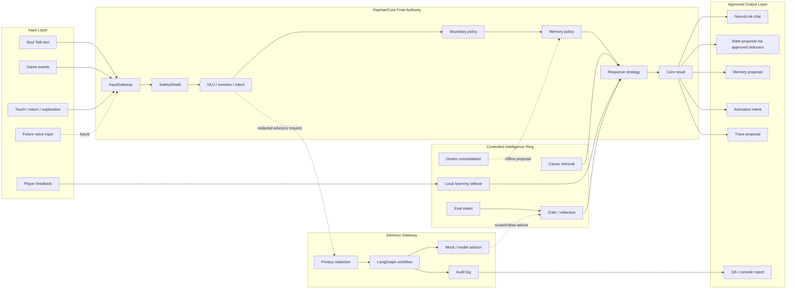

# Raphael Agent System Architecture V1

Status: design handoff, not runtime integration  
Purpose: define a controlled Raphael AI system inspired by a central-agent
architecture while preserving Nexus Link's companion contract.

## Executive Position

Raphael can become a reusable AI companion / creature / opponent engine, but it
must not become an unrestricted autonomous task agent.

Stable identity:

```text
RaphaelCore is a Stateful Companion Cognition Agent.
RaphaelCore remains final authority for safety, boundary, memory, state deltas,
and response policy.
Gateway, LangGraph, training bundles, external models, and future automation
connectors are advisory or peripheral systems only.
```

## Capability Target

The target system can eventually support:

- text input from Soul Talk;
- optional future voice input outside the current frontend;
- local player preference learning;
- canon/lore retrieval with source-aware answers;
- memory proposal and review;
- dream/offline consolidation;
- critic/reflection loops;
- QA-only model/gateway comparison;
- future Telegram, n8n, or robot connectors as separate approved backends.

The target system must not:

- store API keys in the frontend;
- let automation write NexusLink save data directly;
- turn high-risk safety events into gameplay;
- reward dependency pressure;
- auto-merge global training from raw player text;
- let an external advisor override RaphaelCore.

## System Diagram



## Layer Contract

### 1. Input Layer

Allowed now:

- Soul Talk text.
- Game events already visible to runtime.
- Touch, return, exploration, standoff, and trace signals.
- Player feedback as local preference signals only.

Future only:

- Voice input.
- Telegram commands.
- n8n workflow events.
- Robot or device events.

Future inputs require backend approval and must not enter the GitHub Pages
frontend with secrets.

### 2. RaphaelCore Final Authority

Core owns:

- safety routing;
- dependency and boundary policy;
- memory write gates;
- emotional state interpretation;
- response strategy;
- state delta policy;
- final player-facing companion output.

Core rejects:

- gameplay framing for safety turns;
- reward for boundary pressure;
- direct memory mutation from advisors;
- external model final authority.

### 3. Controlled Intelligence Ring

These systems improve maturity without replacing Core:

- NLU expansion through eval cases.
- Canon retrieval with source-aware answers.
- Local player learning sidecar for one-player preferences.
- Critic/reflection to reduce generic replies and policy failures.
- Dream/offline consolidation as proposal-only summaries.

### 4. Advisory Gateway

Gateway can:

- normalize requests;
- run policy gates;
- redact private fields;
- retrieve approved corpus;
- call mock or future model advisors;
- validate structured advisor output;
- produce audit records.

Gateway cannot:

- write save data;
- write memories;
- grant rewards;
- trigger animation directly;
- override safety;
- become the final speaker.

Required advisor flags:

```json
{
  "trusted": false,
  "authorityReport": {
    "finalAuthority": "RaphaelCore",
    "advisorOverrideApplied": false
  }
}
```

### 5. Approved Output Layer

NexusLink receives only RaphaelCore-approved outputs:

- reply candidate;
- emotional state;
- boundary action;
- memory proposal;
- behavior intent;
- animation intent;
- trace proposal;
- audit metadata.

Preview or QA-only outputs must remain:

```json
{
  "trusted": false,
  "appliedToLive": false
}
```

## Relationship To Existing Work

Already present in NexusLink:

- `src/ai/raphaelCore.js`
- safety shield
- NLU pipeline
- memory recall/write gates
- response strategy/composer
- critic modules
- advisory training adapter
- preview staging adapter
- restricted habitat-agent intents
- QA smoke and readiness gates

Already present in sibling `raphael-ai-engine`:

- game-neutral contract;
- core mock engine;
- NexusLink and generic-game adapters;
- local learning sidecar;
- canon retrieval lab;
- critic loop;
- gateway maturity design;
- test suites.

Already present in LangGraph labs:

- shared gateway schema;
- fixture parity;
- mock-only LangGraph.js and Python flows;
- generated static training bundle.

## Phase Roadmap

### Phase A - Documentation And Fable 5 Handoff

Goal:
Create the controlled handoff package and architecture map.

Allowed:

- artifact inventory;
- Fable prompt;
- architecture doc;
- eval plan.

Forbidden:

- runtime behavior changes;
- frontend API keys;
- gateway live routing;
- save schema changes.

### Phase B - Natural Conversation Eval Expansion

Goal:
Make basic and daily-life conversation measurable.

Add cases for:

- greeting;
- daily routine;
- tiredness;
- food / sleep / work;
- mixed Chinese/English;
- short player messages;
- emoji-only;
- apology after boundary;
- normal closeness not misclassified as dependency;
- dependency pressure;
- high-risk safety;
- canon known/unknown.

Pass criteria:

- fewer generic/template replies;
- no safety gamification;
- no reward for dependency pressure;
- stable structured output.

### Phase C - Local Player Learning UX

Goal:
Let one player teach Raphael preferences across sessions without global
training.

Examples:

- "shorter replies";
- "do not always ask me questions";
- "I liked that reply";
- "remember this, if policy allows";
- "that sounded too template-like".

Rules:

- local only;
- revocable;
- no surprise save schema change;
- no raw global training;
- safety and boundary still win.

### Phase D - Raphael Agent Console

Goal:
Build a read-only operator surface for maturity testing.

Panels:

- current core decision;
- safety/boundary status;
- memory proposals;
- canon retrieval sources;
- local learning profile;
- critic findings;
- gateway preview comparison;
- eval results.

Rules:

- QA-only first;
- no player-visible automation;
- no memory write button without policy review;
- no direct store mutation.

### Phase E - Backend Gateway Staging

Goal:
Connect optional staging gateway as advisory comparison.

Rules:

- frontend has no API key;
- fallback to local RaphaelCore;
- preview only until approved;
- trusted:false;
- full audit.

### Phase F - Optional Automation Connectors

Goal:
Explore Telegram, n8n, voice, or robot connectors as separate backend modules.

Rules:

- not inside GitHub Pages static frontend;
- opt-in;
- consent-gated;
- redacted;
- auditable;
- never allowed to modify NexusLink save state directly.

## Fable 5 Work Boundaries

Fable 5 is suitable for:

- long-form implementation;
- eval case expansion;
- Soul Talk naturalness improvements;
- UX design for local teaching;
- dashboard / console surfaces;
- docs cleanup.

Fable 5 must not do without separate human approval:

- commit or push;
- alter `saveManager.js`;
- alter `defaultState.js`;
- alter `store.js` normalization;
- alter `pixiApp.js`;
- alter `assets/**`;
- add package dependencies;
- add build steps;
- add backend secrets;
- live-wire external LLMs;
- make RaphaelCore subordinate to gateway/advisors.

## Release Gate For Any Runtime Step

Before staging:

- changed JS syntax checks pass;
- Raphael smoke passes;
- NLU smoke passes;
- high-risk safety cases produce no gameplay/reward/memory mutation;
- dependency pressure produces boundary support only;
- save schema unchanged;
- companion data unchanged;
- Pixi renderer unchanged;
- browser Soul Talk smoke passes;
- ledger updated.

Before main:

- staging QA passes;
- phone test passes;
- human explicitly approves release task;
- no `canAutoMerge:false` artifact is force-merged;
- worktree is scoped and explainable.

